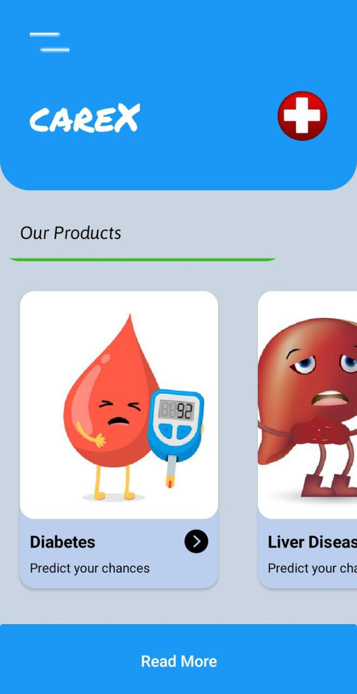
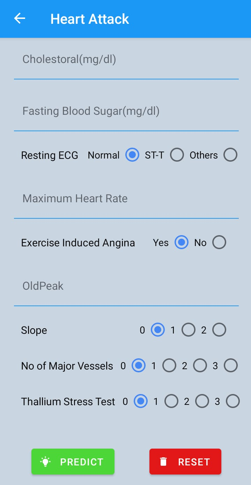
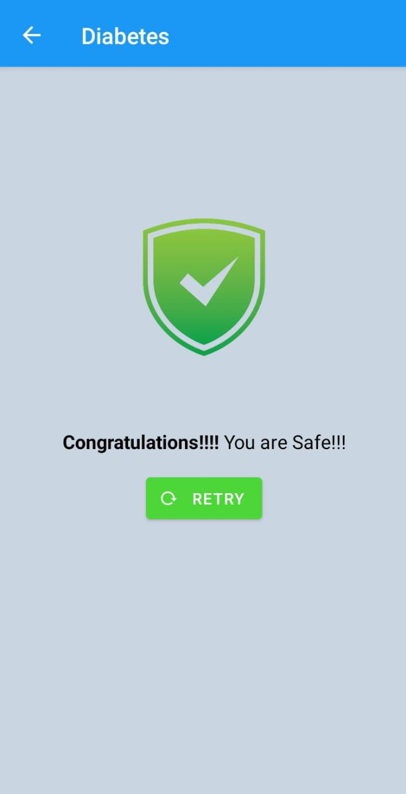
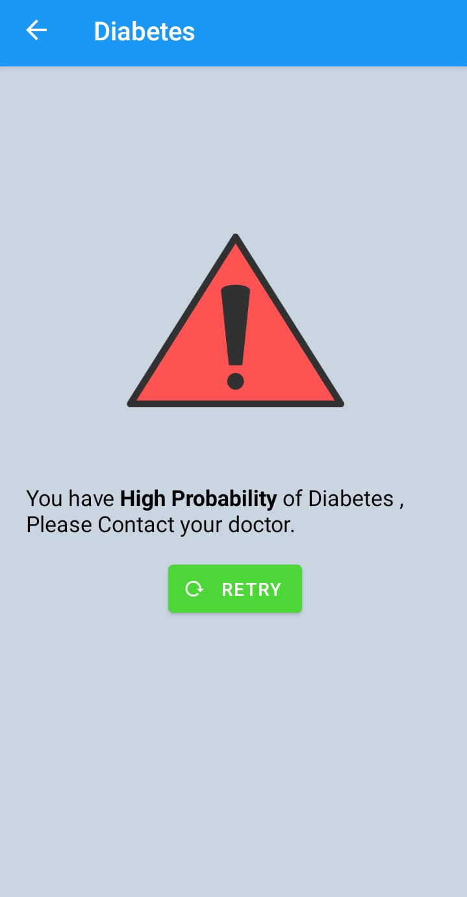

# CAREX  
### `A health Prediction App`

        

## Tech Stacks

### `Frontend`
 - React Native
 - Expo
 - React Native Paper
 - React Native Element

### `Backend`
 - Python
 - Flask
 - Scikit Learn
 - Pandas
 - Numpy

 The Backend is deployed on Heroku & the app is built by Expo
## Datasets & Models Used

 - [Diabetes](https://www.kaggle.com/uciml/pima-indians-diabetes-database): Suppor Vector Classifier(77%)
 - [Liver](https://www.kaggle.com/uciml/indian-liver-patient-records): Decision Tree Classifier (62%)
 - [Kidney](https://www.kaggle.com/mansoordaku/ckdisease): Random Forest Classifier (98%)
 - [Heart Attack](https://www.kaggle.com/rashikrahmanpritom/heart-attack-analysis-prediction-dataset): Suppor Vector Classifier(94%)
 - [Anemia](https://www.kaggle.com/mansoordaku/ckdisease): Random Forest Classifier (90%)

[Backend](https://github.com/Soham-Official/careX_backend) Code of this App

## How to Use ?
 Download the .apk file from this repository.
 
 # Project Created by:
  [Soham Chakraborty](https://soham-official.github.io/)        
  [Prarthita Samaddar](https://www.linkedin.com/in/prarthita-samadder-4371461bb/)
 
